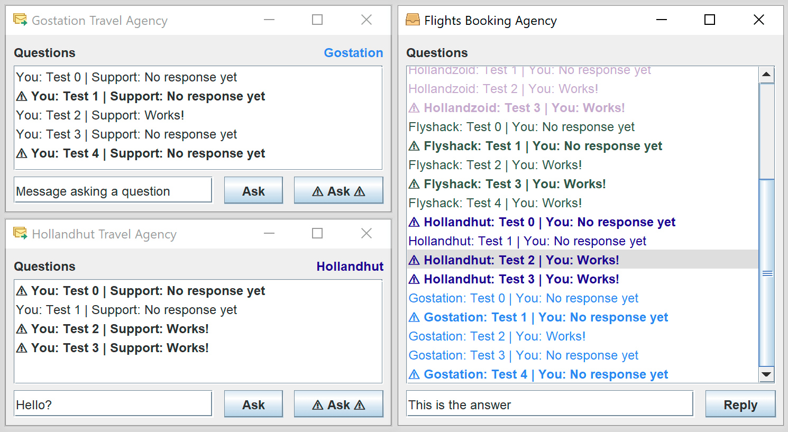

# JMS



## Setup

1. Install Java 11
1. Open the project with Intellij Idea
1. In the Run/Debug configurations run:
    1. Run `ActiveMQ`, two pupups will appear, click `Run` and `Continue Aniway`
    1. Run `Receiver` 
    1. Run `Requester 1`, `Requester 2` or `Requester 1`
    
## Notes

- Messages are encoded in this JSON format.
```json
{
  "name": "Holland Express",
  "color": "#238F1B",
  "question": "Is the ticket #12 for sale?",
  "response": "Yes, it is."
}
```
- It is possible to start multiple Requestor applications, each one will have a random name and color.
- The `⚠ Ask ⚠` button will send the message in another channel.
